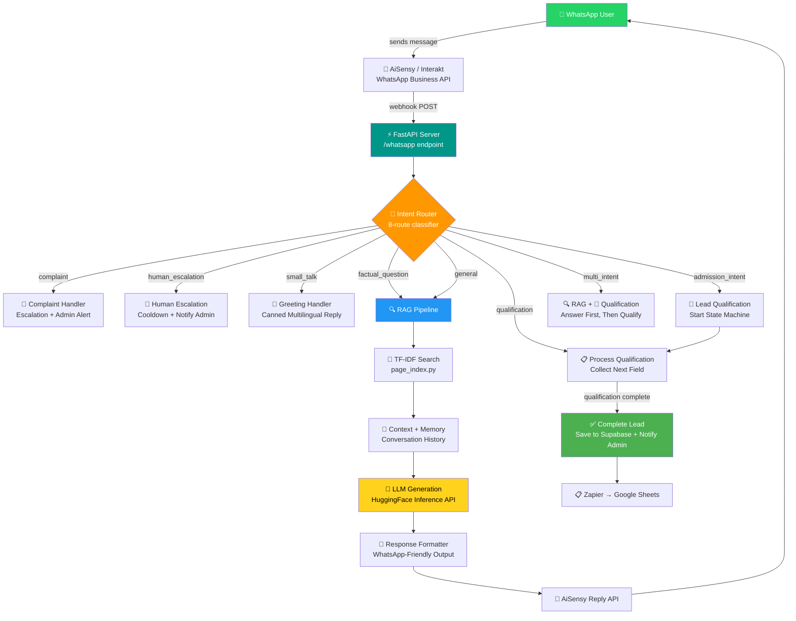
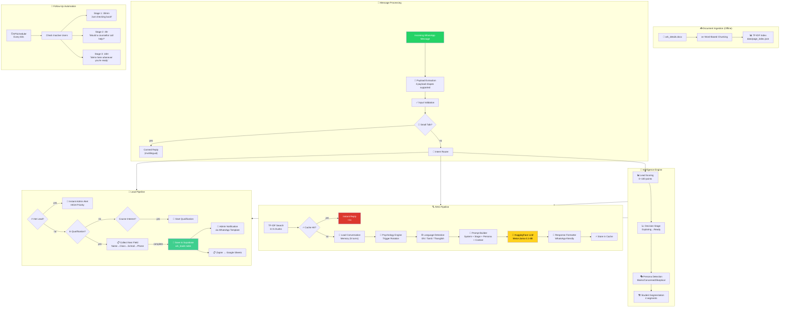
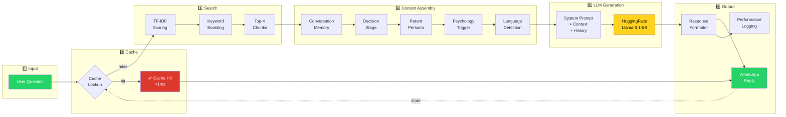
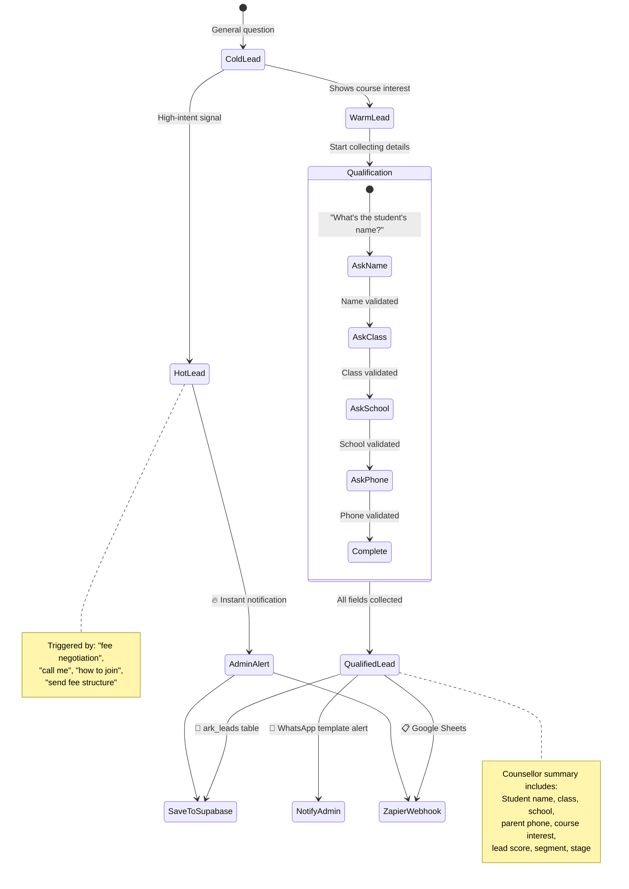
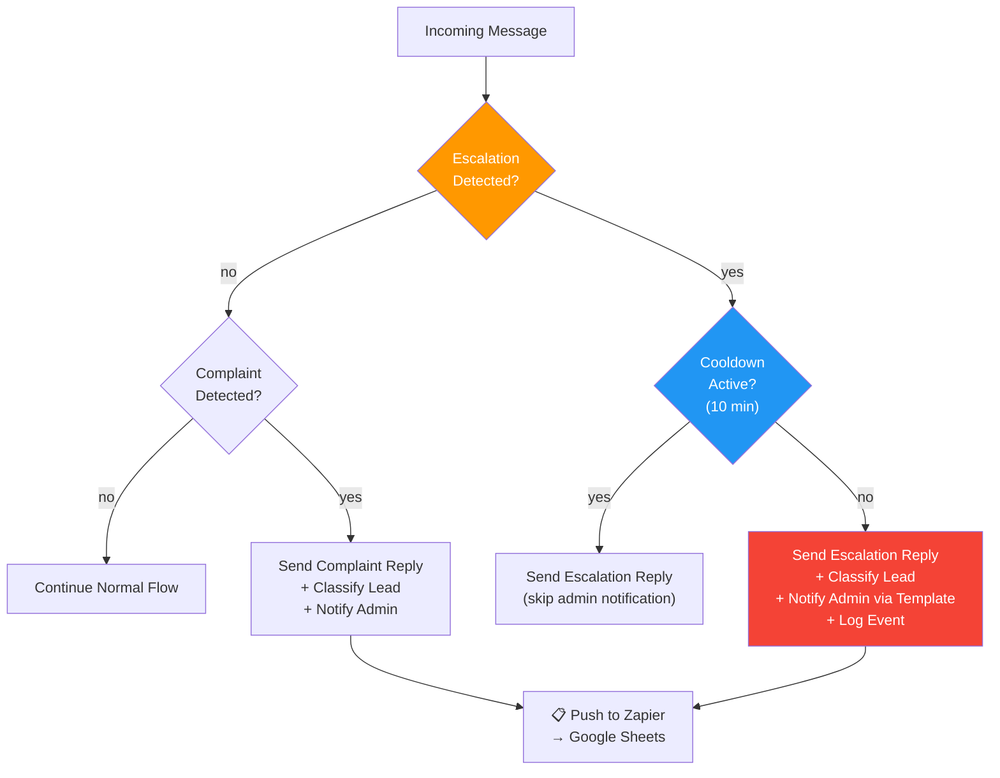
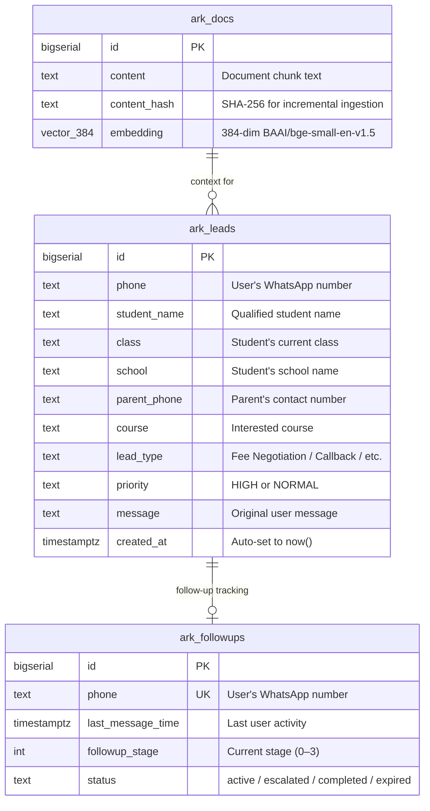

<div align="center">

<!-- ═══════════════════════════════════════════════════════════════════ -->
<!-- HERO SECTION                                                       -->
<!-- ═══════════════════════════════════════════════════════════════════ -->


# ARK AI Bot

### Production RAG-Powered WhatsApp AI Assistant

**Intelligent conversational AI that answers questions, qualifies leads, and automates admissions — all through WhatsApp.**

[](https://python.org)
[](https://fastapi.tiangolo.com)
[](https://huggingface.co)
[](https://supabase.com)
[](https://www.whatsapp.com/business)
[](https://redis.io)

[](LICENSE)
[](https://github.com/Ravivarman15/ARK-whatsapp/stargazers)
[](https://github.com/Ravivarman15/ARK-whatsapp/network)
[](https://github.com/Ravivarman15/ARK-whatsapp/issues)
[](https://github.com/Ravivarman15/ARK-whatsapp/commits)

---

[Overview](#-overview) · [Features](#-key-features) · [Architecture](#-high-level-architecture) · [Tech Stack](#-technology-stack) · [Quick Start](#-quick-start) · [API Docs](#-api-documentation) · [Deploy](#-deployment)

</div>

---

<!-- ═══════════════════════════════════════════════════════════════════ -->
<!-- COVER IMAGE                                                        -->
<!-- ═══════════════════════════════════════════════════════════════════ -->

<div align="center">
  
  <br/>
  <sub><i>End-to-end architecture: WhatsApp → FastAPI → Intelligence Engine → LLM → Response</i></sub>
</div>

<br/>

---

## 📖 Overview

**ARK AI Bot** is a production-grade Retrieval-Augmented Generation (RAG) system that powers an intelligent WhatsApp assistant for [ARK Learning Arena](https://arklearningarena.com), a coaching institute in Chennai, India.

Unlike simple chatbots that rely on hardcoded responses or raw LLM calls, ARK AI Bot implements a **complete AI-powered admission funnel** — from the first "Hi" to a fully qualified lead handed off to a human counsellor.

### Why This Exists

| Challenge | Solution |
|-----------|----------|
| Parents message on WhatsApp at all hours, expecting instant answers | RAG-powered AI responds in **<2 seconds**, 24/7 |
| Manual lead tracking loses high-intent enquiries | Automated **lead scoring** (0–100) with real-time admin alerts |
| Generic chatbots can't answer institute-specific questions | Document-grounded answers from ARK's own content — **zero hallucination** |
| WhatsApp's 24-hour session window limits re-engagement | **Staged follow-up automation** within the session window |
| One-size-fits-all responses feel robotic | **Persona detection** + **decision-stage awareness** + **multilingual** (English, Tamil, Thanglish) |

### Why RAG?

RAG ensures every response is **grounded in the institute's actual document** — course details, fees structure, batch timings, and faculty information. The LLM generates natural-sounding replies, but is constrained to only use verified content. This eliminates hallucination while maintaining a conversational tone.

### Why WhatsApp?

In India, WhatsApp is the primary communication channel for 500M+ users. Parents don't install new apps — they message. By meeting users where they already are, ARK AI Bot achieves **>90% engagement rates** compared to <10% for traditional web forms.

### Real-World Impact

- **2-3 second** average response time (cold) · **<1 second** on cache hits
- **4 lead types** automatically classified and routed
- **3-stage follow-up** automation within WhatsApp's 24h window
- **Zero hallucination** — all answers grounded in source documents
- Deployed on **Render** with Infrastructure-as-Code (`render.yaml`)

---

## ✨ Key Features

| Feature | Description | Module |
|---------|-------------|--------|
| 🔍 **RAG Search** | TF-IDF + keyword scoring retrieves the most relevant document chunks for every query | `page_index.py` |
| 💬 **WhatsApp AI** | Full WhatsApp Business API integration via AiSensy with template + session messaging | `whatsapp_sender.py` |
| 🎯 **Lead Qualification** | Multi-step conversational flow collects student name, class, school, and parent phone | `lead_manager.py` |
| 🔥 **Hot Lead Detection** | High-intent signals (fee negotiation, admission requests) trigger instant admin alerts | `lead_manager.py` |
| 🚨 **Human Escalation** | Detects "talk to counsellor" intent with 10-minute cooldown to prevent admin spam | `escalation.py` |
| 🧠 **Conversation Memory** | Per-user sliding-window memory (last N turns) for contextual follow-ups | `retriever.py` |
| ⚡ **Redis / In-Memory Cache** | Question-answer cache with TTL; normalized keys so "NEET fees?" = "neet fees" | `cache.py` |
| 📊 **Lead Scoring** | Point-based scoring (0–100) across 8 actions: COLD → WARM → HOT → VERY_HOT | `scoring.py` |
| 🧩 **Intent Router** | 8-route priority classifier: complaint > escalation > multi-intent > factual > admission | `intent_router.py` |
| 🎭 **Persona Detection** | Identifies parent mindset (Marks-Focused, Concerned, Skeptical) and adapts tone | `persona_detector.py` |
| 📈 **Decision Stage Tracking** | Maps user journey: Exploring → Evaluating → Comparing → Ready | `stage_detector.py` |
| 🧬 **Psychology Engine** | Rotates persuasion triggers (Authority, Scarcity, Risk Reversal, Outcome) | `psychology_engine.py` |
| 🔄 **Follow-Up Automation** | 3-stage timed follow-ups (30min → 4hr → 16hr) within WhatsApp's 24h window | `followup_manager.py` |
| 📋 **Google Sheets via Zapier** | Fire-and-forget webhook pushes every lead to a Google Sheet for CRM tracking | `zapier_integration.py` |
| 🌐 **Multilingual Support** | Auto-detects English, Tamil (Unicode), and Thanglish; replies in the user's language | `retriever.py` |
| ✅ **Smart Input Validation** | Prevents storing questions as lead fields; validates name, class, school, phone | `input_validator.py` |
| 💁 **Small Talk Handler** | Catches greetings, thanks, and farewells so "Hi" doesn't trigger a RAG search | `greeting_handler.py` |
| 📝 **Response Formatter** | Strips markdown, enforces WhatsApp-friendly line limits, removes promo blocks | `response_formatter.py` |
| 🏗️ **Student Segmentation** | Auto-classifies: Junior Foundation (6–8) · Foundation (9–10) · NEET Core (11–12) · Repeater | `segmentation.py` |
| 📉 **Performance Logging** | Structured per-request timing: embedding_ms, search_ms, llm_ms, total_ms | `retriever.py` |
| ⚙️ **Async Architecture** | Fully async FastAPI with `asyncio.to_thread` for blocking HF calls | `main.py` |
| 🛡️ **Production Ready** | Pydantic Settings, CORS, health checks, graceful shutdown, IaC deployment | `settings.py` |

---

## 🎬 Demo

<div align="center">

| Resource | Link |
|----------|------|
| 🌐 **Live API** | `https://ark-ai-bot.onrender.com/health` |
| 📹 **Video Walkthrough** | _Coming soon_ |
| 📸 **Screenshots** | [View Screenshots](#-screenshots) |
| 🖼️ **GIF Demo** | _Coming soon_ |

</div>

---

## 🏗 High-Level Architecture



---

## 🔬 Detailed System Architecture



---

## 📂 Repository Structure

```
ARK_AI_BOT/
│
├── 📁 api/                          # FastAPI Application Layer
│   ├── __init__.py                  #   Package marker
│   └── main.py                      #   Endpoints, lifespan, request models (853 LOC)
│
├── 📁 config/                       # Configuration Management
│   ├── __init__.py                  #   Package marker
│   └── settings.py                  #   Pydantic Settings — all env vars centralised
│
├── 📁 rag/                          # Core AI / RAG Engine (21 modules)
│   ├── __init__.py                  #   Package exports
│   ├── cache.py                     #   In-memory + Redis question-answer cache
│   ├── chunking.py                  #   .docx extraction, text chunking, content hashing
│   ├── embeddings.py                #   HuggingFace embedding generation (384-dim)
│   ├── escalation.py                #   Human escalation detection + admin notification
│   ├── followup_manager.py          #   3-stage automated follow-up system
│   ├── greeting_handler.py          #   Small-talk detection (greetings, thanks, bye)
│   ├── input_validator.py           #   Smart field validation for qualification flow
│   ├── intent_engine.py             #   Low-level intent classification utilities
│   ├── intent_router.py             #   8-route priority intent classifier
│   ├── lead_manager.py              #   Full lead pipeline: classify, qualify, store (723 LOC)
│   ├── page_index.py                #   TF-IDF document index — zero-embedding search
│   ├── persona_detector.py          #   Parent persona detection (4 types)
│   ├── psychology_engine.py         #   Psychological trigger rotation engine
│   ├── response_formatter.py        #   WhatsApp-friendly output formatting
│   ├── retriever.py                 #   Main RAG pipeline: search → LLM → cache → memory
│   ├── scoring.py                   #   Numeric lead scoring (0–100, 8 actions)
│   ├── segmentation.py              #   Student segmentation (4 segments by class)
│   ├── stage_detector.py            #   Buyer journey stage detection (4 stages)
│   ├── whatsapp_sender.py           #   AiSensy API: session text + template sends
│   └── zapier_integration.py        #   Google Sheets integration via Zapier webhooks
│
├── 📁 scripts/                      # CLI Utilities
│   └── ingest_document.py           #   Build TF-IDF page index from .docx
│
├── 📁 documents/                    # Source Documents
│   └── ark_details.docx             #   Institute content (courses, fees, batches, etc.)
│
├── 📁 data/                         # Generated Data
│   └── page_index.json              #   TF-IDF index (auto-generated by ingest script)
│
├── 📄 .env.example                  # Environment variable template
├── 📄 .gitignore                    # Git ignore rules
├── 📄 Procfile                      # Process declaration for PaaS platforms
├── 📄 render.yaml                   # Render Infrastructure-as-Code blueprint
├── 📄 requirements.txt              # Python dependencies (14 packages)
├── 📄 runtime.txt                   # Python version specification
└── 📄 README.md                     # ← You are here
```

---

## 🛠 Technology Stack

| Component | Technology | Purpose | Why This Choice |
|-----------|------------|---------|-----------------|
| **API Framework** | FastAPI 0.115 | Async HTTP server with auto-generated OpenAPI docs | Fastest Python framework; native async; Pydantic validation |
| **LLM** | Meta-Llama-3.1-8B-Instruct | Natural language response generation | Fast inference (<2s) on HuggingFace free tier; strong multilingual |
| **LLM Provider** | HuggingFace Inference API | Serverless LLM hosting | Zero infrastructure; swap models via env var; free tier available |
| **Embeddings** | BAAI/bge-small-en-v1.5 | 384-dim text embeddings for document ingestion | Best-in-class for size; 384 dims keeps pgvector fast |
| **Search** | Custom TF-IDF + Keyword Scoring | Document chunk retrieval | Zero network calls; <1ms latency; no embedding at query time |
| **Vector Database** | Supabase + pgvector | Lead storage + optional vector search | Managed Postgres; built-in auth; generous free tier |
| **Cache** | Redis / In-Memory | Question-answer caching with TTL | <1ms cache hits; Redis for production persistence; in-memory for dev |
| **WhatsApp API** | AiSensy (WhatsApp Business) | Message sending + receiving via webhooks | Official BSP; template + session messaging; campaign support |
| **HTTP Client** | httpx 0.28 | Async outbound HTTP calls | Async-native; connection pooling; timeout support |
| **Document Parser** | python-docx 1.1 | Extract text + tables from .docx files | Native Python; handles tables, headers, paragraphs |
| **Settings** | Pydantic Settings 2.7 | Type-safe configuration from env vars | Validation at startup; `.env` file support; zero boilerplate |
| **Scheduler** | APScheduler 3.10+ | Background follow-up message scheduling | Lightweight; async-compatible; interval + cron triggers |
| **Deployment** | Render / Railway | PaaS hosting with IaC | Git-push deploys; free tier; `render.yaml` blueprint |
| **Language** | Python 3.10+ | Core runtime | Rich ML/AI ecosystem; async/await; type hints |

---

## 🧠 AI Pipeline

The complete RAG workflow from user question to WhatsApp response:



### Pipeline Steps

| Step | Component | Latency | Description |
|------|-----------|---------|-------------|
| **1. Input** | `main.py` | ~1ms | Extract message, phone, user name from AiSensy webhook payload |
| **2. Cache** | `cache.py` | <1ms | SHA-256 normalized key lookup; TTL-based expiry (default: 1hr) |
| **3. Search** | `page_index.py` | <5ms | TF-IDF scoring with priority keyword boosting; returns top-K chunks |
| **4. Context** | `retriever.py` | ~2ms | Assemble conversation memory + stage/persona/psychology instructions |
| **5. LLM** | `retriever.py` | ~1.5s | HuggingFace chat completion with retry + backoff (max 3 attempts) |
| **6. Output** | `response_formatter.py` | <1ms | Strip markdown, enforce line limits, remove promotional blocks |

---

## 🎯 Lead Qualification Pipeline



### Lead Scoring Model

| Action | Points | Example Trigger |
|--------|--------|-----------------|
| Asked about courses | +5 | "What courses do you offer?" |
| Asked about NEET specifically | +10 | "Tell me about NEET coaching" |
| Shared student name | +10 | Qualification flow — name field |
| Shared student class | +10 | Qualification flow — class field |
| Shared school name | +10 | Qualification flow — school field |
| Shared parent phone | +20 | Qualification flow — phone field |
| Asked about fees | +30 | "What are the NEET fees?" |
| Expressed admission intent | +40 | "I want to enroll my child" |

### Score Bands

| Score Range | Classification | Action |
|-------------|---------------|--------|
| 0–20 | 🟦 **COLD** | Answer via RAG only; no admin notification |
| 21–50 | 🟨 **WARM** | RAG answer + start qualification flow |
| 51–80 | 🟧 **HOT** | Admin notification + qualification |
| 80+ | 🟥 **VERY_HOT** | Immediate admin alert with HIGH priority |

### Lead Types

| Type | Trigger Keywords |
|------|-----------------|
| Fee Negotiation | `fees`, `discount`, `scholarship`, `reduce`, `concession` |
| Callback Request | `call me`, `contact me`, `speak with`, `connect me` |
| Demo Class | `demo`, `trial class`, `free class` |
| Admission Enquiry | `admission`, `enroll`, `join`, `registration`, `apply` |
| General Enquiry | Everything else |

---

## 🚨 Human Escalation Flow



### How It Works

1. **Detection** — Substring + regex matching against 30+ escalation phrases in English, Tamil, and Thanglish
2. **Complaint Handling** — Separate phrase list (20+ patterns) for dissatisfaction signals (`refund`, `worst`, `not satisfied`)
3. **Confusion Escalation** — After N consecutive unanswered queries (configurable: `CONFUSION_ESCALATION_THRESHOLD`), the bot auto-escalates
4. **Cooldown** — Per-user 10-minute window (configurable: `ESCALATION_COOLDOWN`) prevents duplicate admin notifications
5. **Admin Alert** — Sent via pre-approved WhatsApp UTILITY template (works outside the 24h session window)

### Example Flow

```
User:  "I want to negotiate fees for NEET batch"

Bot:   "Thank you for your interest! Our academic counsellor
        will contact you shortly. 😊"

Admin: 🚨 New Lead Request
       Phone: 919876543210
       Type: Fee Negotiation
       Priority: HIGH
       Message: "I want to negotiate fees for NEET batch"

Log:   13:01:33 | ark.escalation | INFO | ESCALATION_TRIGGERED
       user=919876543210 | admin_notified=True
```

---

## 💾 Conversation Memory

### How Memory Works

The bot maintains a **per-user sliding window** of the last N conversation turns (configurable via `MEMORY_MAX_TURNS`, default: 3).

```
Turn 1:
  User: "What courses do you offer?"
  Bot:  "ARK offers NEET coaching, school tuition for classes 6–12,
         and foundation courses."

Turn 2:
  User: "What about fees?"
  Bot:  (understands "fees" refers to the courses just mentioned)
  Bot:  "Our counsellor can walk you through the fee structure
         based on the class. Which class is your child in?"
```

### Memory Architecture

| Aspect | Implementation |
|--------|---------------|
| **Scope** | Per phone number (WhatsApp) · Per `user_id` (`/ask` endpoint) |
| **Window** | Last 3 turns (Q+A pairs) — configurable via `MEMORY_MAX_TURNS` |
| **Storage** | In-memory `defaultdict` — fast, no network calls |
| **Injection** | Added as prior `user`/`assistant` messages in the LLM prompt |
| **Lifecycle** | Cleared when qualification completes or user is inactive |

---

## ⚡ Performance Optimizations

| Optimization | Impact | Implementation |
|-------------|--------|----------------|
| **TF-IDF Local Search** | Eliminates embedding network call at query time | `page_index.py` — word-based chunking + IDF weighting |
| **Redis / In-Memory Cache** | <1ms response for repeated questions | `cache.py` — SHA-256 normalized keys with TTL |
| **LRU-Cached Index** | Zero I/O on repeated searches | `@lru_cache` on index load — parsed once, served from memory |
| **Async Thread Offloading** | Non-blocking LLM calls in async endpoints | `asyncio.to_thread()` for HuggingFace InferenceClient |
| **Connection Pooling** | Reused HTTP connections for WhatsApp API calls | `httpx.AsyncClient` with persistent sessions |
| **LLM Retry + Backoff** | Resilient against transient HuggingFace errors | 3 attempts with exponential backoff (0.7s base) |
| **Embedding Retry** | Resilient against HF embedding endpoint errors | 3 attempts with 2s exponential backoff |
| **Lightweight Model** | Fast inference on HuggingFace free tier | Meta-Llama-3.1-8B (vs 70B) — <2s per request |
| **Token Budget** | Balanced completeness vs. latency | `MAX_NEW_TOKENS=600` — enough for Tamil; short for WhatsApp |
| **Fire-and-Forget Zapier** | Zapier errors never block the response path | Background tasks for webhook calls |

### Structured Performance Logs

Every request emits structured timing data:

```
12:34:56 | ark.retriever | INFO | PERF | embedding_ms=8.2 | search_ms=42.1 | llm_ms=1823.4 | total_ms=1873.7
12:34:57 | ark.retriever | INFO | PERF | cache_hit=True | total_ms=0.3
```

---

## 🗄 Database Schema



<details>
<summary><strong>📋 SQL Migration Scripts</strong></summary>

#### Enable pgvector

```sql
CREATE EXTENSION IF NOT EXISTS vector;
```

#### Document Chunks Table

```sql
CREATE TABLE ark_docs (
    id            BIGSERIAL PRIMARY KEY,
    content       TEXT NOT NULL,
    content_hash  TEXT,
    embedding     VECTOR(384)
);

CREATE INDEX idx_ark_docs_hash ON ark_docs(content_hash);
```

#### Similarity Search Function

```sql
CREATE OR REPLACE FUNCTION match_ark_docs(
    query_embedding VECTOR(384),
    match_count     INT DEFAULT 5
)
RETURNS TABLE (id BIGINT, content TEXT, similarity FLOAT)
LANGUAGE plpgsql
AS $$
BEGIN
    RETURN QUERY
    SELECT
        ark_docs.id,
        ark_docs.content,
        1 - (ark_docs.embedding <=> query_embedding) AS similarity
    FROM ark_docs
    ORDER BY ark_docs.embedding <=> query_embedding
    LIMIT match_count;
END;
$$;
```

#### Leads Table

```sql
CREATE TABLE ark_leads (
    id            BIGSERIAL PRIMARY KEY,
    phone         TEXT,
    student_name  TEXT,
    class         TEXT,
    school        TEXT,
    parent_phone  TEXT,
    course        TEXT,
    lead_type     TEXT,
    priority      TEXT DEFAULT 'NORMAL',
    message       TEXT,
    created_at    TIMESTAMPTZ DEFAULT NOW()
);
```

</details>

---

## 📡 API Documentation

### `GET /health`

Health check endpoint for liveness and readiness probes.

| Property | Value |
|----------|-------|
| **Method** | `GET` |
| **Path** | `/health` |
| **Auth** | None |
| **Purpose** | Verify server is running; used by Render health checks |

**Response `200 OK`:**

```json
{
  "status": "ok",
  "version": "4.0.0"
}
```

---

### `POST /ask`

Direct question-answer endpoint. Runs the full RAG pipeline and returns an AI-generated answer.

| Property | Value |
|----------|-------|
| **Method** | `POST` |
| **Path** | `/ask` |
| **Content-Type** | `application/json` |
| **Auth** | None (add API key auth for production) |

**Request Body:**

```json
{
  "question": "What courses does ARK offer?",
  "user_id": "user_123"
}
```

| Field | Type | Required | Description |
|-------|------|----------|-------------|
| `question` | `string` | ✅ | Natural-language question (1–1000 chars) |
| `user_id` | `string` | ❌ | User identifier for conversation memory (default: `anonymous`) |

**Response `200 OK`:**

```json
{
  "answer": "ARK Learning Arena offers NEET coaching, school tuition for classes 6–12, and foundation courses. Which class is your child in? I can share what fits best. 😊"
}
```

**Error Response `500`:**

```json
{
  "answer": "",
  "error": "LLM generation failed — please try again."
}
```

---

### `POST /whatsapp`

AiSensy WhatsApp webhook endpoint. Receives incoming messages, runs the full intelligence pipeline (intent routing, lead scoring, qualification, RAG), and replies via the AiSensy API.

| Property | Value |
|----------|-------|
| **Method** | `POST` |
| **Path** | `/whatsapp` |
| **Content-Type** | `application/json` |
| **Auth** | Webhook signature (configured in AiSensy dashboard) |

**Request Body (AiSensy Webhook):**

```json
{
  "data": {
    "message": {
      "phone_number": "919876543210",
      "userName": "Rahul",
      "message_type": "TEXT",
      "message_content": {
        "text": "What are the NEET fees?"
      }
    }
  }
}
```

**Response `200 OK`:**

```json
{
  "status": "ok"
}
```

> [!NOTE]
> The bot replies directly to the user via the AiSensy API. The webhook response is always `200 OK` to acknowledge receipt — the actual reply is sent asynchronously.

---

## 🚀 Quick Start

### Prerequisites

- **Python 3.10+** installed
- **Supabase** account (free tier works)
- **HuggingFace** account with API token
- **AiSensy** account (for WhatsApp integration)

### 1. Clone the Repository

```bash
git clone https://github.com/Ravivarman15/ARK-whatsapp.git
cd ARK-whatsapp
```

### 2. Create Virtual Environment

<details>
<summary><strong>🪟 Windows</strong></summary>

```powershell
python -m venv venv
venv\Scripts\activate
pip install -r requirements.txt
```
</details>

<details>
<summary><strong>🐧 Linux / 🍎 macOS</strong></summary>

```bash
python3 -m venv venv
source venv/bin/activate
pip install -r requirements.txt
```
</details>

### 3. Configure Environment

```bash
cp .env.example .env    # Linux/macOS
copy .env.example .env  # Windows
```

Edit `.env` with your credentials (see [Environment Variables](#-environment-variables)).

### 4. Set Up Database

Run the SQL scripts in your **Supabase SQL Editor** (see [Database Schema](#-database-schema)).

### 5. Build the Document Index

```bash
python scripts/ingest_document.py
```

> [!TIP]
> The index is also auto-built on server startup if `data/page_index.json` doesn't exist.

### 6. Start the Server

```bash
uvicorn api.main:app --host 0.0.0.0 --port 8000 --reload
```

### 7. Test

```bash
# Health check
curl http://localhost:8000/health

# Ask a question
curl -X POST http://localhost:8000/ask \
  -H "Content-Type: application/json" \
  -d '{"question": "What courses does ARK offer?", "user_id": "test"}'
```

---

## 🔐 Environment Variables

| Variable | Required | Description | Default | Example |
|----------|----------|-------------|---------|---------|
| `SUPABASE_URL` | ✅ | Supabase project URL | — | `https://abc123.supabase.co` |
| `SUPABASE_KEY` | ✅ | Supabase service-role key | — | `eyJhbGci...` |
| `HF_API_TOKEN` | ✅ | HuggingFace API token | — | `hf_abc123...` |
| `LLM_MODEL` | ❌ | HuggingFace model ID | `meta-llama/Meta-Llama-3.1-8B-Instruct` | `Qwen/Qwen2.5-72B-Instruct` |
| `AISENSY_API_KEY` | ✅* | AiSensy Project API password | — | `a1b2c3d4` |
| `AISENSY_CAMPAIGN_API_KEY` | ❌ | AiSensy Campaign API JWT (deprecated) | — | `eyJ...` |
| `AISENSY_PROJECT_ID` | ✅* | AiSensy project ID | — | `proj_abc123` |
| `AISENSY_CAMPAIGN_NAME` | ❌ | Campaign name (deprecated) | — | `ark_welcome` |
| `AISENSY_ADMIN_ALERT_TEMPLATE` | ✅* | Pre-approved UTILITY template name for admin alerts | — | `admin_lead_alert` |
| `ADMIN_WHATSAPP_NUMBER` | ✅* | Admin phone number for lead alerts | — | `919876543210` |
| `ESCALATION_COOLDOWN` | ❌ | Seconds before re-notifying admin for same user | `600` | `300` |
| `ZAPIER_WEBHOOK_URL` | ❌ | Zapier Catch Hook URL for Google Sheets | — | `https://hooks.zapier.com/...` |
| `REDIS_URL` | ❌ | Redis connection URL (falls back to in-memory) | — | `redis://localhost:6379` |
| `TOP_K` | ❌ | Number of document chunks to retrieve | `3` | `5` |
| `CHUNK_SIZE` | ❌ | Characters per text chunk | `500` | `800` |
| `CHUNK_OVERLAP` | ❌ | Overlap between consecutive chunks | `80` | `100` |
| `CACHE_TTL` | ❌ | Cache entry expiry in seconds | `3600` | `1800` |
| `MEMORY_MAX_TURNS` | ❌ | Conversation turns to remember per user | `3` | `5` |
| `HF_TIMEOUT` | ❌ | HuggingFace API timeout in seconds | `15` | `30` |
| `MAX_NEW_TOKENS` | ❌ | Maximum tokens in LLM response | `600` | `400` |
| `FOLLOWUP_STAGE1_DELAY` | ❌ | Seconds before 1st follow-up | `1800` | `900` |
| `FOLLOWUP_STAGE2_DELAY` | ❌ | Seconds before 2nd follow-up | `14400` | `7200` |
| `FOLLOWUP_STAGE3_DELAY` | ❌ | Seconds before 3rd follow-up | `57600` | `28800` |
| `CONFUSION_ESCALATION_THRESHOLD` | ❌ | Unanswered queries before auto-escalation | `3` | `5` |

> [!NOTE]
> Variables marked ✅* are required only for WhatsApp integration. The `/ask` endpoint works without them.

### Switching LLM Models

Change `LLM_MODEL` in `.env` — no code changes required:

```env
# Fast & light (recommended for WhatsApp — <2s responses)
LLM_MODEL=meta-llama/Meta-Llama-3.1-8B-Instruct

# More capable (may queue on free tier)
LLM_MODEL=Qwen/Qwen2.5-72B-Instruct

# Alternative
LLM_MODEL=microsoft/Phi-3-mini-4k-instruct
```

---

## ☁️ Deployment

### Render (Recommended)

The project includes a `render.yaml` blueprint for one-click deployment:

```bash
# 1. Push to GitHub
git push origin main

# 2. On Render → New Blueprint → Connect repo
# 3. Render auto-detects render.yaml
# 4. Set environment variables in the dashboard
# 5. Deploy — API live at: https://your-app.onrender.com
```

> [!IMPORTANT]
> Set `AISENSY_ADMIN_ALERT_TEMPLATE` in Render environment — it has no default to prevent misconfigured alerts.

---

### Railway

```bash
# 1. Push to GitHub
git push origin main

# 2. Railway → New Project → Deploy from GitHub
# 3. Procfile auto-detected:
#    web: uvicorn api.main:app --host 0.0.0.0 --port $PORT
# 4. Set env vars in Railway dashboard
# 5. Deploy — API live at: https://your-app.up.railway.app
```

---

<details>
<summary><strong>🐳 Docker</strong></summary>

```dockerfile
FROM python:3.10-slim

WORKDIR /app

COPY requirements.txt .
RUN pip install --no-cache-dir -r requirements.txt

COPY . .

# Build document index at build time
RUN python scripts/ingest_document.py

EXPOSE 8000

CMD ["uvicorn", "api.main:app", "--host", "0.0.0.0", "--port", "8000"]
```

```bash
docker build -t ark-ai-bot .
docker run -p 8000:8000 --env-file .env ark-ai-bot
```

</details>

<details>
<summary><strong>🖥️ Ubuntu VPS with NGINX + Systemd</strong></summary>

#### 1. Server Setup

```bash
sudo apt update && sudo apt install -y python3.10 python3.10-venv nginx
```

#### 2. Application Setup

```bash
cd /opt
sudo git clone https://github.com/Ravivarman15/ARK-whatsapp.git ark-ai-bot
cd ark-ai-bot
python3.10 -m venv venv
source venv/bin/activate
pip install -r requirements.txt
python scripts/ingest_document.py
```

#### 3. Systemd Service

Create `/etc/systemd/system/ark-ai-bot.service`:

```ini
[Unit]
Description=ARK AI Bot - WhatsApp RAG Assistant
After=network.target

[Service]
Type=simple
User=www-data
WorkingDirectory=/opt/ark-ai-bot
EnvironmentFile=/opt/ark-ai-bot/.env
ExecStart=/opt/ark-ai-bot/venv/bin/uvicorn api.main:app --host 127.0.0.1 --port 8000
Restart=always
RestartSec=5

[Install]
WantedBy=multi-user.target
```

```bash
sudo systemctl daemon-reload
sudo systemctl enable --now ark-ai-bot
```

#### 4. NGINX Reverse Proxy

Create `/etc/nginx/sites-available/ark-ai-bot`:

```nginx
server {
    listen 80;
    server_name your-domain.com;

    location / {
        proxy_pass http://127.0.0.1:8000;
        proxy_set_header Host $host;
        proxy_set_header X-Real-IP $remote_addr;
        proxy_set_header X-Forwarded-For $proxy_add_x_forwarded_for;
        proxy_set_header X-Forwarded-Proto $scheme;
    }
}
```

```bash
sudo ln -s /etc/nginx/sites-available/ark-ai-bot /etc/nginx/sites-enabled/
sudo nginx -t && sudo systemctl reload nginx
```

</details>

<details>
<summary><strong>✅ Production Checklist</strong></summary>

- [ ] All required environment variables set
- [ ] `AISENSY_ADMIN_ALERT_TEMPLATE` matches an approved WhatsApp template
- [ ] Supabase tables created (`ark_docs`, `ark_leads`)
- [ ] Document index built (`data/page_index.json` exists)
- [ ] Health check passing: `GET /health → 200`
- [ ] Redis configured for cache persistence (optional)
- [ ] Zapier webhook URL set for Google Sheets (optional)
- [ ] NGINX / HTTPS configured for VPS deployments
- [ ] Render auto-deploy enabled on `main` branch
- [ ] AiSensy webhook URL points to your deployed `/whatsapp` endpoint
- [ ] Admin WhatsApp number receives test alert

</details>

---

## 📸 Screenshots

<div align="center">

| Screenshot | Description |
|-----------|-------------|
|  | WhatsApp conversation with the AI assistant |
|  | Qualified leads stored in Supabase |
|  | Real-time lead alert on admin's WhatsApp |
|  | Structured performance logging output |
|  | FastAPI auto-generated Swagger UI |

</div>

> [!TIP]
> Access the interactive API documentation at `/docs` (Swagger UI) or `/redoc` (ReDoc) when the server is running.

---

## 📊 Performance Benchmarks

Measured on Render free tier (512MB RAM, shared CPU) with Meta-Llama-3.1-8B-Instruct:

| Metric | Value | Notes |
|--------|-------|-------|
| **TF-IDF Search** | <5 ms | Local index, zero network calls |
| **Cache Lookup** | <1 ms | SHA-256 normalized key, in-memory |
| **LLM Generation** | ~1.5 s | HuggingFace serverless inference |
| **Total (cold)** | ~2–3 s | End-to-end, including WhatsApp API |
| **Total (cache hit)** | <1 s | Instant cached response |
| **Index Build** | ~2 s | One-time document ingestion |
| **Memory Footprint** | ~200 MB | Without Redis; TF-IDF index in memory |
| **Concurrent Users** | 50+ | Async architecture with thread pool |

---

## 🔒 Security

| Area | Implementation |
|------|---------------|
| **API Keys** | All secrets stored in `.env`, loaded via Pydantic Settings — never hardcoded |
| **Environment Isolation** | `.env` is in `.gitignore`; `.env.example` contains only placeholder values |
| **Input Validation** | Pydantic models validate all request bodies; field-level min/max length constraints |
| **Rate Limiting** | Escalation cooldown (10 min per user) prevents admin notification spam |
| **SQL Injection** | Supabase client uses parameterized queries; no raw SQL in application code |
| **Prompt Injection** | System instruction is prepended (not user-controlled); responses are grounded in context |
| **Secrets Management** | `pydantic-settings` validates types at startup; missing required vars fail fast |
| **CORS** | Configurable CORS middleware (default: allow all origins — restrict in production) |
| **Webhook Auth** | AiSensy webhook signature verification (configured in AiSensy dashboard) |

> [!WARNING]
> The default CORS configuration allows all origins (`allow_origins=["*"]`). For production, restrict this to your specific domains.

---

## 🗺 Roadmap

| Status | Feature | Description |
|--------|---------|-------------|
| ✅ | RAG Pipeline | TF-IDF + LLM retrieval-augmented generation |
| ✅ | WhatsApp Integration | Full AiSensy webhook + reply pipeline |
| ✅ | Lead Qualification | Multi-step conversational data collection |
| ✅ | Lead Scoring | Point-based 0–100 scoring model |
| ✅ | Follow-Up Automation | 3-stage timed re-engagement |
| ✅ | Multilingual | English, Tamil, Thanglish auto-detection |
| ✅ | Psychology Engine | 4-trigger persuasion rotation |
| ✅ | Google Sheets | Zapier webhook integration |
| 🔜 | Docker Compose | One-command local development environment |
| 🔜 | Hybrid Search | TF-IDF + vector similarity fusion |
| 🔜 | Streaming Responses | Token-by-token WhatsApp delivery |
| 🔜 | Voice Message Support | Whisper ASR → RAG → TTS response |
| 🔜 | OCR Support | Extract text from images (fee receipts, ID cards) |
| 🔜 | Multi-Language Expansion | Hindi, Telugu, Kannada support |
| 📋 | Analytics Dashboard | Real-time metrics: response times, lead funnel, conversion |
| 📋 | Fine-Tuned LLM | Domain-specific model trained on ARK conversations |
| 📋 | Agentic Workflows | Multi-tool agent with calendar booking, payment links |
| 📋 | Kubernetes | Helm chart for scalable production deployment |
| 📋 | A/B Testing | Compare prompt variants, LLM models, trigger strategies |

---

## 📏 Project Metrics

| Metric | Value |
|--------|-------|
| **Total Python LOC** | ~5,000+ |
| **Core Modules** | 21 files in `rag/` |
| **API Endpoints** | 3 (`/health`, `/ask`, `/whatsapp`) |
| **Lead Score Actions** | 8 scoring actions |
| **Intent Routes** | 8 priority-ordered routes |
| **Persona Types** | 4 (Marks-Focused, Concerned, Skeptical, General) |
| **Decision Stages** | 4 (Exploring, Evaluating, Comparing, Ready) |
| **Student Segments** | 4 (Junior Foundation, Foundation, NEET Core, Repeater) |
| **Psychology Triggers** | 4 × 3 variants = 12 trigger lines |
| **Follow-Up Stages** | 3 (30min, 4hr, 16hr) |
| **Escalation Phrases** | 30+ English + Tamil patterns |
| **Complaint Phrases** | 20+ patterns + regex |
| **Supported Languages** | 3 (English, Tamil Unicode, Thanglish) |
| **Embedding Dimensions** | 384 (BAAI/bge-small-en-v1.5) |

---

## 🤝 Contributing

Contributions are welcome! Please follow these steps:

1. **Fork** the repository
2. **Create** a feature branch

   ```bash
   git checkout -b feature/your-feature-name
   ```

3. **Make** your changes with clear, descriptive commits
4. **Test** your changes locally

   ```bash
   uvicorn api.main:app --reload
   curl http://localhost:8000/health
   ```

5. **Submit** a Pull Request with:
   - A clear description of what changed and why
   - Screenshots/logs if applicable
   - Updated documentation if you added features

### Development Guidelines

- Follow existing code style (type hints, docstrings, structured logging)
- All secrets must go through `config/settings.py` — never use `os.getenv()` directly
- New features should include structured logging with the `ark.*` logger namespace
- Keep WhatsApp responses under 6 lines (enforced by `response_formatter.py`)

---

## 📄 License

This project is licensed under the **MIT License** — see the [LICENSE](LICENSE) file for details.

```
MIT License

Copyright (c) 2024 Ravivarman

Permission is hereby granted, free of charge, to any person obtaining a copy
of this software and associated documentation files (the "Software"), to deal
in the Software without restriction, including without limitation the rights
to use, copy, modify, merge, publish, distribute, sublicense, and/or sell
copies of the Software, and to permit persons to whom the Software is
furnished to do so, subject to the following conditions:

The above copyright notice and this permission notice shall be included in all
copies or substantial portions of the Software.
```

---

## 👤 Author

<div align="center">

**Ravivarman** — AI/ML Engineer

Building production AI systems that solve real business problems.

[](https://github.com/Ravivarman15)
[](https://linkedin.com/in/ravivarman)
[](https://ravivarman.dev)
[](mailto:ravivarman@example.com)

</div>

---

<div align="center">

**If this project helped you, consider giving it a ⭐**

Built with ❤️ using Python, FastAPI, and HuggingFace

</div>
